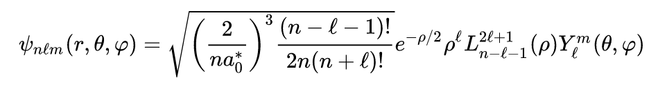
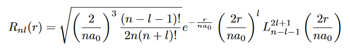
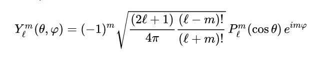

# Hydrogen wavefunctions

Modeling and visualization of solutions for 
the hydrogen atom wavefunction and electron 
probability-density plots

* Python 3.9.0
* Matplotlib 3.5.1
* SciPy 1.7.3
* NumPy 1.22.1

---

## Theory
### QM Introduction: Wavefunctions, Atomic orbitals and probability

Quantum mechanics use wavefunctions to describe the mathematical 
relationship between the motion of electrons in atoms and molecules 
and their energies.

A wavefunction (Ψ) is a mathematical function that relates the 
location of an electron at a given point in space 
(identified by x, y, and z coordinates) to the amplitude of its 
wave, which corresponds to its energy.

<br>
<p align='center'>
  
</p>
<p align='center'>
    <i>Wavefunction probability-density plots</i>
</p>

The probability of finding an electron at a given point is proportional to 
the square of the wavefunction at that point, leading to a distribution of 
probabilities in space that is often portrayed as an electron density plot.

An atomic orbital is a mathematical function describing 
the wave-like behavior of an electron in an atom. Orbitals are 
mathematically derived regions of space where the electron can be calculated to be present.

<br>
<p align='center'>
    
</p>
<p align='center'>
    <i>Light shaded areas represent high probability density, 
    darker areas represent lower probability density</i>
</p>

The description of electron distribution as standing waves leads naturally
to the existence of sets of quantum numbers (n, l, m) characteristic of each 
wavefunction.

---

### Quantum Numbers

Schrödinger’s approach uses three quantum numbers (n, l, m) 
to specify any wavefunction. The quantum numbers provide information 
about the spatial distribution of an electron. 

Although n can be any positive integer, only certain values of 
l and m are allowed for a given value of n.

* **Principal quantum number (n):** `( 1 <= n )`

Average relative distance of 
an electron from the nucleus

* **Azimuthal quantum number (l):** `( 0 <= l <= n-1 )`

Shape of the region of 
space occupied by the electron.

* **Magnetic quantum number (m):** `( -l <= m <= l )`

Orientation of the region in space occupied by an electron with respect to 
an applied magnetic field.

---

### Hydrogen wavefunction modeling

We may solve Schrödinger’s equation more easily if we express it in 
terms of the spherical coordinates (r, θ, φ) instead of rectangular 
coordinates (x, y, z).

In spherical coordinates, the variable r is the radial coordinate, 
θ is the polar angle (relative to the vertical z-axis), 
and φ is the azimuthal angle (relative to the x-axis)

<br>
<p align='center'>
  
</p>
<p align='center'>
    <i>Relationship between the spherical and rectangular coordinate systems</i>
</p>

The wavefunctions for the hydrogen atom depend upon the three variables r, θ, and φ 
and the three quantum numbers n, l, and m. 
The solutions to the hydrogen atom Schrödinger equation are functions that are 
products of a Radial Function and a Spherical Harmonic Function.

<br>
<p align='center'>
  
</p>
<p align='center'>
    <i>Normalized position wavefunctions, given in spherical coordinates</i>
</p>

<p align='center'>
    
</p>
<p align='center'>
    <i>Normalized radial function</i>
</p>

<p align='center'>
    
</p>
<p align='center'>
    <i>Normalized angular function (spherical harmonic function)</i>
</p>

<br>
The absolute square of the wavefunction, evaluated at r, θ,
and φ gives the probability density of finding the electron.

---
## Execution
#### Display help:

```
$ python wavefunction.py --help   
usage: wavefunction.py [-h] -n  -l  -m  -a0  [-cm]

Hydrogen wavefunction probability-density by definition of quantum numbers 
n, l, m and bohr radius

optional arguments:
  -h, --help  show this help message and exit
  -n          (n) principal quantum number (constraint: 1 <= n)
  -l          (l) azimuthal quantum number (constraint: 0 <= l <= n-1)
  -m          (m) magnetic quantum number (constraint: -l <= m <= l)
  -a0         (a0) bohr radius (constraint: 1 <= a0)
  -cm         (color map) optional color scheme |input choices: 1, 2, 3, 4
```
---

### Example 1
#### Input args:
    $ python wavefunction.py -n 4 -l 3 -m 0 -a0 11

| Flag |          Argument           | Value |  Constraint   |
|:----:|:---------------------------:|:-----:|:-------------:|
|  -n  |     Principal QN    (n)     |   4   |    1 <= n     |
|  -l  |    Azimuthal QN     (l)     |   3   | 0 <= l <= n-1 |
|  -m  |   Magnetic QN        (m)    |   0   | -l <= m <= l  |
| -a0  | Bohr radius (a<sub>0</sub>) |  11   |    1 <= a0    |

#### Output plot:
<p align='center'>
  
</p>

---
